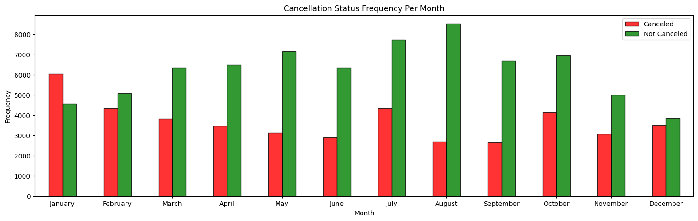
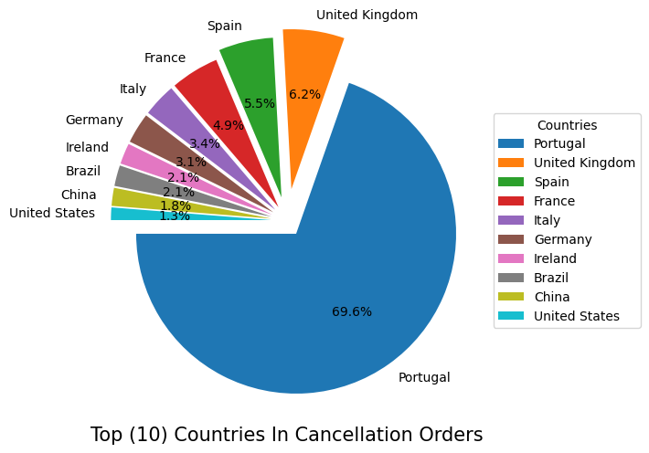
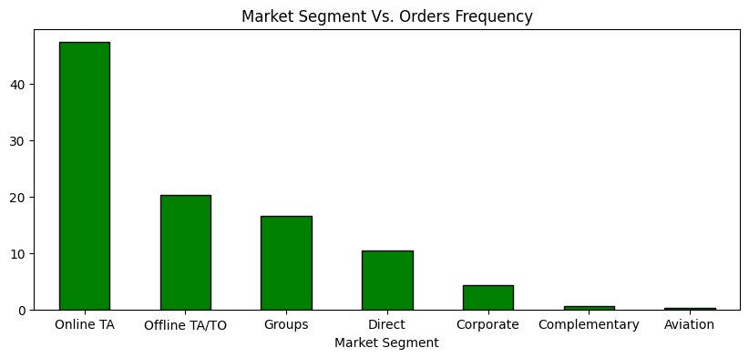
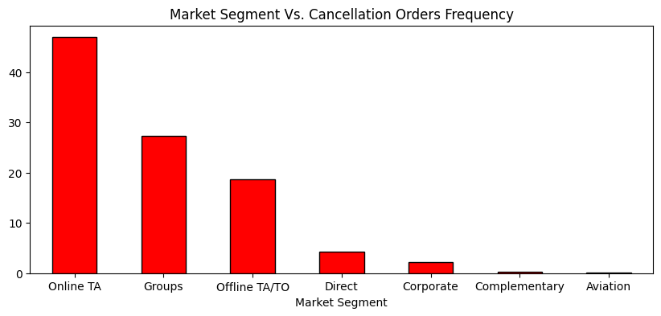
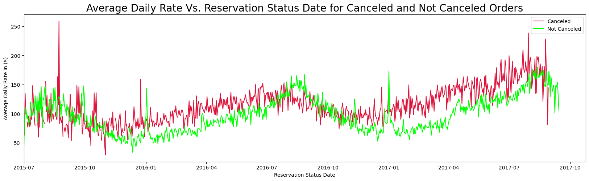
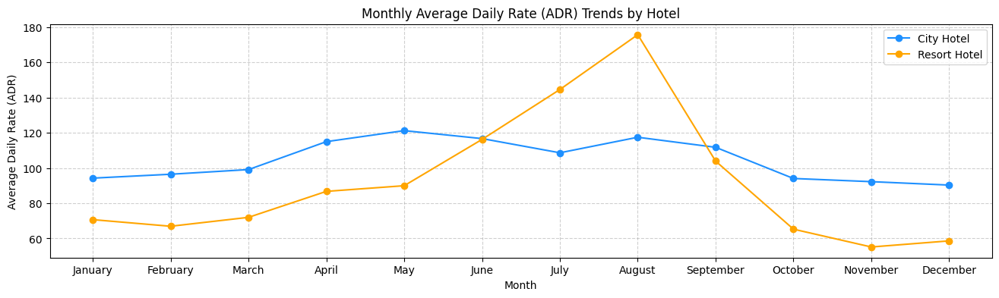

# **Uncovering the Drivers Behind Rising Hotel Cancellation Rates: Data Analysis Project**

## **(1) Project Roadmap:**

1. **Define Problem Statement:** Address the issue of increasing cancellation orders in hotels.
2. **Data Identification:** Select the dataset `hotels.csv` for analysis.
3. **Data Preparation:** Clean and explore the data using Python to ensure quality and consistency.
4. **Data Analysis:** Extract insights to identify reasons behind the rise in hotel cancellation orders.

## **(2) Introduction:**
This project aims to identify the key factors contributing to the **increasing rate of hotel booking cancellations**. We will explore primary reasons, such as **high average daily rates**, and secondary factors, including **discrepancies between online hotel photos and actual conditions**. Utilizing the **Python** programming language, we will begin with **data cleaning, manipulation, and normalization using the Pandas library to handle outliers and null values**. Our dataset comprises information from two distinct types of hotels: **city hotel and resort hotel**. Following this, we will employ **data visualization tools like Matplotlib and Seaborn to create insightful plots**. Through detailed analysis of these visualizations, we will uncover the underlying reasons for the surge in hotel cancellation orders.

## **(3) Tools I Used:**
1. **Kaggle**: Source of the hotels dataset.
2. **Python Programming Language**: Used for overall data manipulation and analysis.
3. **Pandas Library**: Utilized for data cleaning, manipulation, standardization (normalization), and handling outliers and null values.
4. **Matplotlib**: Employed for data visualization.
5. **Seaborn**: Used for statistical data visualization.
6. **Git & GitHub**: for sharing my analysis and insights.

## **(4) Data Inspection:**
### **4.1. Import Important Libraries and Modules:**
```py
import pandas as pd
import numpy as np 
import matplotlib.pyplot as plt
import matplotlib.patches as mpatches
import seaborn as sns
import datetime as dt
```

## **4.2. Export Target Dataframe:**
```py
df = pd.read_csv('D:\\IT Courses\\Data Analysis Courses\\Data Analysis Projects\\Hotels Exploratory Data Analysis (EDA) Project\\Hotels_Exploratory_Data_Analysis_EDA_Project\\Dataset\\hotels.csv')
```

## **(5) Data Cleaning and Formatting:**
### **5.1. Dealing With Nan Values:**

**5.1.1. Drop Columns ('agent', 'company'):**
```py
df_copy.drop(
    ['agent', 'company'],
    axis=1,
    inplace=True
)
```

**5.1.2. Drop Nan Values Of Columns ('country', 'children'):**
```py
df_copy.dropna(
    subset=('country', 'children'),
    axis=0,
    inplace=True
)
```
### **5.2. Type Casting of Column (reservation_status_date) to Datetime:**
```py
df_copy['reservation_status_date'] = pd.to_datetime(df_copy['reservation_status_date'])
# 118898 non-null  datetime64[ns]
```
### **5.3. Data Normalization and Standardization:**
**5.2.1. Data Normalization of Column (meal):**

**Based on common hotel meal abbreviations, here are the likely full names for each abbreviation in the column:** 

- **BB**: Bed and Breakfast
- **FB**: Full Board (typically includes breakfast, lunch, and dinner)
- **HB**: Half Board (typically includes breakfast and dinner)
- **SC**: Self Catering
- **Undefined**: Undefined (no specific meal plan specified)
```py
meal_column_dictionary = {
    'BB':'Bed & Breakfast',
    'FB':'Full Board',
    'HB':'Half Board',
    'SC':'Self Catering',
    'Undefined':'Undefined'
}
```
```py
def meal_normalization(meal_column):
    for key, value in meal_column_dictionary.items():
        if key.upper() == meal_column.upper():
            return(value)
    else:
        return(meal_column)

df_copy['meal'] = df_copy['meal'].apply(meal_normalization)
```

**5.2.2. Data Normalization of Column (country):**
```py
country_codes_to_names = {
    'PRT': 'Portugal',
    'GBR': 'United Kingdom',
    'USA': 'United States',
    'ESP': 'Spain',
    'IRL': 'Ireland',
    'FRA': 'France',
    'ROU': 'Romania',
    'NOR': 'Norway',
    'OMN': 'Oman',
    'ARG': 'Argentina',
    'POL': 'Poland',
    'DEU': 'Germany',
    'BEL': 'Belgium',
    'CHE': 'Switzerland',
    'CN': 'China', 
    'GRC': 'Greece',
    'ITA': 'Italy',
    'Unknown' : 'Not Disclose',
    'NLD': 'Netherlands',
    'DNK': 'Denmark',
    'RUS': 'Russia',
    'SWE': 'Sweden',
    'AUS': 'Australia',
    'EST': 'Estonia',
    'CZE': 'Czech Republic',
    'BRA': 'Brazil',
    'FIN': 'Finland',
    'MOZ': 'Mozambique',
    'BWA': 'Botswana',
    'LUX': 'Luxembourg',
    'SVN': 'Slovenia',
    'ALB': 'Albania',
    'IND': 'India',
    'CHN': 'China',
    'MEX': 'Mexico',
    'MAR': 'Morocco',
    'UKR': 'Ukraine',
    'SMR': 'San Marino',
    'LVA': 'Latvia',
    'PRI': 'Puerto Rico',
    'SRB': 'Serbia',
    'CHL': 'Chile',
    'AUT': 'Austria',
    'BLR': 'Belarus',
    'LTU': 'Lithuania',
    'TUR': 'Turkey',
    'ZAF': 'South Africa',
    'AGO': 'Angola',
    'CYM': 'Cayman Islands',
    'ZMB': 'Zambia',
    'CPV': 'Cabo Verde',
    'ZWE': 'Zimbabwe',
    'DZA': 'Algeria',
    'KOR': 'South Korea',
    'CRI': 'Costa Rica',
    'HUN': 'Hungary',
    'ARE': 'United Arab Emirates',
    'TUN': 'Tunisia',
    'JAM': 'Jamaica',
    'HRV': 'Croatia',
    'HKG': 'Hong Kong',
    'IRN': 'Iran',
    'GEO': 'Georgia',
    'AND': 'Andorra',
    'GIB': 'Gibraltar',
    'URY': 'Uruguay',
    'JEY': 'Jersey',
    'CAF': 'Central African Republic',
    'CYP': 'Cyprus',
    'COL': 'Colombia',
    'GGY': 'Guernsey',
    'KWT': 'Kuwait',
    'NGA': 'Nigeria',
    'MDV': 'Maldives',
    'VEN': 'Venezuela',
    'SVK': 'Slovakia',
    'FJI': 'Fiji',
    'KAZ': 'Kazakhstan',
    'PAK': 'Pakistan',
    'IDN': 'Indonesia',
    'LBN': 'Lebanon',
    'PHL': 'Philippines',
    'SEN': 'Senegal',
    'SYC': 'Seychelles',
    'AZE': 'Azerbaijan',
    'BHR': 'Bahrain',
    'NZL': 'New Zealand',
    'THA': 'Thailand',
    'DOM': 'Dominican Republic',
    'MKD': 'North Macedonia',
    'MYS': 'Malaysia',
    'ARM': 'Armenia',
    'JPN': 'Japan',
    'LKA': 'Sri Lanka',
    'CUB': 'Cuba',
    'CMR': 'Cameroon',
    'BIH': 'Bosnia and Herzegovina',
    'MUS': 'Mauritius',
    'COM': 'Comoros',
    'SUR': 'Suriname',
    'UGA': 'Uganda',
    'BGR': 'Bulgaria',
    'CIV': "Cote d'Ivoire",
    'JOR': 'Jordan',
    'SYR': 'Syria',
    'SGP': 'Singapore',
    'BDI': 'Burundi',
    'SAU': 'Saudi Arabia',
    'VNM': 'Vietnam',
    'PLW': 'Palau',
    'QAT': 'Qatar',
    'EGY': 'Egypt',
    'PER': 'Peru',
    'MLT': 'Malta',
    'MWI': 'Malawi',
    'ECU': 'Ecuador',
    'MDG': 'Madagascar',
    'ISL': 'Iceland',
    'UZB': 'Uzbekistan',
    'NPL': 'Nepal',
    'BHS': 'Bahamas',
    'MAC': 'Macau',
    'TGO': 'Togo',
    'TWN': 'Taiwan',
    'DJI': 'Djibouti',
    'STP': 'Sao Tome and Principe',
    'KNA': 'Saint Kitts and Nevis',
    'ETH': 'Ethiopia',
    'IRQ': 'Iraq',
    'HND': 'Honduras',
    'RWA': 'Rwanda',
    'KHM': 'Cambodia',
    'MCO': 'Monaco',
    'BGD': 'Bangladesh',
    'IMN': 'Isle of Man',
    'TJK': 'Tajikistan',
    'NIC': 'Nicaragua',
    'BEN': 'Benin',
    'VGB': 'British Virgin Islands',
    'TZA': 'Tanzania',
    'GAB': 'Gabon',
    'GHA': 'Ghana',
    'TMP': 'East Timor',
    'GLP': 'Guadeloupe',
    'KEN': 'Kenya',
    'LIE': 'Liechtenstein',
    'GNB': 'Guinea-Bissau',
    'MNE': 'Montenegro',
    'UMI': 'United States Minor Outlying Islands',
    'MYT': 'Mayotte',
    'FRO': 'Faroe Islands',
    'MMR': 'Myanmar',
    'PAN': 'Panama',
    'BFA': 'Burkina Faso',
    'LBY': 'Libya',
    'MLI': 'Mali',
    'NAM': 'Namibia',
    'BOL': 'Bolivia',
    'PRY': 'Paraguay',
    'BRB': 'Barbados',
    'ABW': 'Aruba',
    'AIA': 'Anguilla',
    'SLV': 'El Salvador',
    'DMA': 'Dominica',
    'PYF': 'French Polynesia',
    'GUY': 'Guyana',
    'LCA': 'Saint Lucia',
    'ATA': 'Antarctica',
    'GTM': 'Guatemala',
    'ASM': 'American Samoa',
    'MRT': 'Mauritania',
    'NCL': 'New Caledonia',
    'KIR': 'Kiribati',
    'SDN': 'Sudan',
    'ATF': 'French Southern Territories',
    'SLE': 'Sierra Leone',
    'LAO': 'Laos'
}
```
```py
def country_normalization(country_column):
    for key, value in country_codes_to_names.items():
        if key.upper() == country_column.upper():
            return(value)
    else:
        return(country_column)

df_copy['country'] = df_copy['country'].apply(country_normalization)
```
**5.2.3. Dta Normalization of Column ('is_canceled')**
```py
is_canceled_dictionary = {
    1 : 'Canceled',
    0 : 'Not Canceled'
}
```
```py
def is_canceled_normalization(is_canceled_column):
    for key, value in is_canceled_dictionary.items():
        if key == is_canceled_column:
            return(value)
    else:
        return(key)

df_copy['is_canceled'] = df_copy['is_canceled'].apply(is_canceled_normalization)
```
### **5.4. Dealing With Ouliers In Column 'adr' Average Daily Rate:**
**5.4.1. Dealing With Outliers In Column "adr" Average Daily Rate:**

**(1) Five Number Summary Of Column 'adr':**
```py
adr_Q1 = np.quantile(df_copy['adr'], 0.25) # 70
adr_Q2 = np.quantile(df_copy['adr'], 0.50) # 95.0
adr_Q3 = np.quantile(df_copy['adr'], 0.75) # 126.0

adr_min = np.min(df_copy['adr']) # -6.38
adr_max = np.max(df_copy['adr']) # 5400.0

adr_IQR = adr_Q3 - adr_Q1 # 56.0

lower_boundry = adr_Q1 - (1.5 * adr_IQR) # -14.0
upper_boundary = adr_Q3 + (1.5 * adr_IQR) # 210.0
```
**(2) "adr" Column Box Plot Visualization to Clearly Show the Variability of the "adr" column Values Before Dealing with Outliers:**
```py
plt.figure(figsize=(18,4))
plt.boxplot(
    x=df_copy['adr'],
    vert=False
)
plt.title('Average Daily Rate Box Plot')
plt.axvline(x=np.mean(df_copy['adr']), color='blue', linestyle='--', label='Mean')
plt.axvline(x=np.quantile(df_copy['adr'], 0.25), color='orange', linestyle='--', label='Q1')
plt.axvline(x=np.quantile(df_copy['adr'], 0.50), color='green', linestyle='--', label='Median')
plt.axvline(x=np.quantile(df_copy['adr'], 0.75), color='yellow', linestyle='--', label='Q3')
plt.legend(loc='upper right')
plt.yticks([])
plt.tight_layout()
```


- **Action:** Delete values in the `adr` column that are above 5000.

- **Reason:** These values have been identified as outliers and may skew the analysis or results. Removing these outliers will help ensure the accuracy and reliability of the data analysis.

- **Impact:** This action will clean the dataset, potentially improving the performance of any models or analyses that rely on this dat

```py
df_copy = df_copy[df_copy['adr'] < 5000]
```

**(3) "adr" Column Box Plot Visualization to Clearly Show the Variability of the "adr" column Values After Dealing with Outliers:**

```py
plt.figure(figsize=(18,4))
plt.boxplot(
    x=df_copy['adr'],
    vert=False
)
plt.title('Average Daily Rate Box Plot')
plt.axvline(x=np.mean(df_copy['adr']), color='blue', linestyle='--', label='Mean')
plt.axvline(x=np.quantile(df_copy['adr'], 0.25), color='orange', linestyle='--', label='Q1')
plt.axvline(x=np.quantile(df_copy['adr'], 0.50), color='green', linestyle='--', label='Median')
plt.axvline(x=np.quantile(df_copy['adr'], 0.75), color='yellow', linestyle='--', label='Q3')
plt.legend(loc='upper right')
plt.yticks([])
plt.tight_layout()
```


## **(6) Export Cleaned and Formatted Dataframe Into CSV File:**

```py
df_copy.to_csv(
    'cleaned_formatted_hotels_df.csv',
    index=False
)
```

## **(7) Exploratory Data Analysis (EDA):**
### **7.1. Hotels Reservation Status Anaysis:**
```py
plt.figure(figsize=(7,5))
round(df['is_canceled'].value_counts(normalize=True) * 100).plot(
    kind='bar',
    color=['green', 'red'],
    width=0.3,
    alpha=0.8,
    edgecolor='k'
)
plt.title('Hotels Reservation Status')
plt.xticks(rotation=0)
plt.xlabel('Reservation Status')
plt.ylabel('Percent %')
```


**Key Insights:**

- A significant insight from this plot is that a majority of the reservations are **not canceled**, indicating that most customers follow through with their hotel bookings. 

- However, **there is still a notable proportion of cancellations, which suggests potential areas for improvement in understanding customer needs or addressing issues that lead to cancellations**. 

### **7.2. Comparison of Reservation Statuses Between City and Resort Hotels:**

```py
fig, ax = plt.subplots(1,2, figsize=(15,5))

hotels_labels = []
for hotel in df['hotel'].value_counts().index:
    hotels_labels.append(hotel)

df['hotel'].value_counts().plot(
    kind='bar',
    color=['blue','orange'],
    edgecolor='black',
    width=0.3,
    alpha=0.8,
    ax=ax[0]
)
ax[0].set_title('Hotels Orders Frequency')
ax[0].set_xlabel('Hotels')
ax[0].set_ylabel('Orders Frequency')
ax[0].set_xticklabels(hotels_labels, rotation=0)

df.pivot_table(index='hotel', columns='is_canceled', aggfunc='size').plot(
    kind='bar',
    color=['red', 'green'],
    edgecolor='black',
    alpha=0.8,
    ax=ax[1]
)
ax[1].legend(title='')
ax[1].set_title('(Resort Hotel - City Hotel) Reservation Status')
ax[1].set_xlabel('Hotels')
ax[1].set_ylabel('Frequency')
ax[1].set_xticklabels(hotels_labels, rotation=0)
```


**Key Insights:**
- **City hotel** experience a **higher volume** of both cancellations and completed stays compared to resort hotels. 

- On the other hand, **resort hotels, while having fewer overall bookings, show a relatively lower frequency of cancellations compared to city hotel**. 

### **7.3. Time Series Analysis of Average Daily Rates for City and Resort Hotels:**
```py
adr_time_series = df.pivot_table(
    index='reservation_status_date',
    columns='hotel',
    values='adr',
    aggfunc='mean'
)
```
```py
adr_time_series['City Hotel'].fillna((df[df['hotel'] == 'City Hotel'])['adr'].mean(), inplace=True)
adr_time_series['Resort Hotel'].fillna((df[df['hotel'] == 'Resort Hotel'])['adr'].mean(), inplace=True)
```
```py
adr_time_series.plot(
    kind='line',
    figsize=(18,5),
    color=['green', 'red']
)
plt.legend()
plt.title('Average Daily Rate Time Series Analysis')
plt.xlabel('Reservation Status Date')
plt.ylabel('Average Daily Rate ($)')
plt.xlim(left=df['reservation_status_date'].min())
plt.show()
```


**Key Insights:**
- **Resort hotels** exhibit significant **volatility** in their average daily rates, with **pronounced peaks that could correspond to seasonal demand or special events, suggesting a more dynamic pricing strategy**. **In contrast, city hotels maintain relatively more stable rates with fewer fluctuations.**

### **7.4. Monthly Trends in Hotels Booking Cancellation Rate:**
```py
df['month_number'] = df['reservation_status_date'].dt.month
```
```py
months_labels = [
    "January", "February", "March", "April",
    "May", "June", "July", "August",
    "September", "October", "November", "December"
]

ax = cancellation_months_pivot = df.pivot_table(
    index='month_number',
    columns='is_canceled',
    aggfunc='size'
).plot(
    kind='bar',
    color=['red', 'green'],
    alpha=0.8,
    edgecolor='black',
    figsize=(18,5)
)
ax.set_xticklabels(labels=months_labels, rotation=0)
plt.legend(title='')
plt.title('Cancellation Status Frequency Per Month')
plt.xlabel('Month')
plt.ylabel('Frequency')
plt.show()
```



**Key Insights:**
- **January and July** exhibit the highest cancellation rates, suggesting potential issues such as post-holiday fatigue or dissatisfaction with holiday bookings.

- **August** shows the highest number of non-canceled bookings, indicating a peak travel period where customer satisfaction or commitment to travel plans is at its highest. 

- The insights suggest a need for **targeted strategies** to reduce cancellations during peak cancellation months, potentially through **improved customer engagement or more accurate service representation.**

## **7.5. Distribution of Cancellation Orders Across Top 10 Countries in the Dataset:**
```py
(df[df['is_canceled'] == 'Canceled']).groupby(
    by=['month_number']
).agg(
    avg_adr=('adr', 'mean')
)
```
```py
country_cancellation_frec = (df[df['is_canceled'] == 'Canceled']).groupby(
    by=['country']
).agg(
    cancellation_frec=('is_canceled', 'size')
).sort_values(
    by=['cancellation_frec'],
    ascending=False
).reset_index().head(10)
```
```py
pie_explode = (0.1, 0.2, 0.15, 0.1, 0.1, 0.1, 0.1, 0.1, 0.1, 0.1)
plt.pie(
    data=country_cancellation_frec,
    x='cancellation_frec',
    labels='country',
    autopct='%1.1f%%',
    startangle=180,
    explode=pie_explode
)
plt.legend(
    country_cancellation_frec['country'],
    title="Countries",
    loc="center left",
    bbox_to_anchor=(1, 0.5))
plt.tight_layout()
plt.xlabel('Top (10) Countries In Cancellation Orders', size=15)
plt.show()
```


**Key Insights:**
- **Portugal** accounts for nearly **70%** of the total cancellations. This suggests potential issues specific to the Portuguese market, such as **economic factors, customer dissatisfaction, or targeted marketing strategies that may not align with customer expectations**.

- **The United Kingdom and Spain** also show notable cancellation rates, indicating regional trends that may require further investigation. 

- The relatively lower cancellation rates from countries like **the United States and China** suggest more stable booking behaviors or higher satisfaction rates. These insights point to the need for localized strategies to address the high cancellation rates in key markets like Portugal, the United Kingdom, and Spain.

## **7.6. Analysis of Hotel Booking Order Frequencies Across Different Market Segments:**
```py
(df['market_segment'].value_counts(normalize=True) * 100).plot(
    kind='bar',
    color='green',
    edgecolor='black',
    figsize=(10,4)
)
plt.xticks(rotation=0)
plt.title('Market Segment Vs. Orders Frequency')
plt.xlabel('Market Segment')
plt.show()
```


**Key Insights:**

- The bar chart reveals that the **Online TA (Travel Agency) marketing segment dominates hotel bookings by a significant margin**, indicating a strong consumer preference for online platforms when reserving hotel accommodations. 

- The **Offline TA/TO (Traditional Travel Agencies/Tour Operators) and Groups segments also contribute notably to the booking frequency**, though to a lesser extent, highlighting the continued relevance of traditional booking methods and group travel. 

- The relatively **low frequency** of bookings in **the Direct, Corporate, Complementary**, and "Aviation" segments suggests either limited engagement for these categories. 

## **7.7. Analysis of Hotel Booking Cancellation Frequencies Across Different Market Segments:**

```py
((df[df['is_canceled'] == 'Canceled'])['market_segment'].value_counts(normalize=True) * 100).plot(
    kind='bar',
    color='red',
    edgecolor='black',
    figsize=(10,4)
)
plt.xticks(rotation=0)
plt.title('Market Segment Vs. Cancellation Orders Frequency')
plt.xlabel('Market Segment')
plt.show()
```


**Key Insights:**
- The chart shows that most hotel booking cancellations happen through **Online TA (Travel Agency)**, suggesting that people might be having **second thoughts** and **discrepancies between online hotel photos and actual conditions** or facing issues with online bookings. 

- The **Groups** segment also has a lot of cancellations, which might be due to **changes in plans or difficulties in organizing group trips**.

## **7.8. Trends of Average Daily Rates for Canceled and Non-Canceled Hotel Orders Over Time for Resort and City Hotels:**

```py
(df[df['reservation_status_date'] >= '2015-07-01']).pivot_table(
    index='reservation_status_date',
    columns='is_canceled',
    values='adr',
    aggfunc='mean'
).plot(
    kind='line',
    figsize=(20,6),
    color=['crimson', 'lime']
)
plt.xlim(left=(df[df['reservation_status_date'] >= '2015-07-01'])['reservation_status_date'].min())
plt.legend(title='', loc='best')
plt.xlabel('Reservation Status Date')
plt.ylabel('Average Daily Rate In ($)')
plt.title('Average Daily Rate Vs. Reservation Status Date for Canceled and Not Canceled Orders', size=20)
plt.xticks(rotation=0, ha='center')
plt.show()
```



**Key Insights:**
- Notably, there are periods where **canceled orders (in red) tend to have higher average daily rates compared to non-canceled orders (in green)**, suggesting that **price sensitivity might be a contributing factor to cancellations**.

- Reservations are **canceled** when the average daily rate is higher than when it is not canceled, so **it means the higher prices of the average daily rate lead to a higher level of cancellation**.

- Peaks in the average daily rates for canceled orders could indicate that **customers are more likely to cancel reservations when prices are higher, possibly due to finding better deals elsewhere or reconsidering the value of their booking**. 

## **7.9 Seasonal Variations in Average Daily Rates for City and Resort Hotels:**

```py
hotel_month_pivot = df.pivot_table(
    index='month_number',
    columns='hotel',
    values='adr',
    aggfunc='mean'
)

ax = hotel_month_pivot.plot(
    kind='line',
    color=['dodgerblue', 'orange'],
    figsize=(16,4),
    marker='o'
)

ax.set_xticks(range(1,13))
ax.set_xticklabels(rotation=0, labels=months_labels)
ax.set_xlabel('Month')
ax.set_ylabel('Average Daily Rate (ADR)')
ax.set_title('Monthly Average Daily Rate (ADR) Trends by Hotel')
ax.grid(True, linestyle='--', alpha=0.6)
plt.legend(title='')
plt.show()
```



For a Resort hotel, the average daily rate is more expensive during July, August, and September, and for City hotel, the average daily rate is more expensive during March, April, and May.

**Key Insights:**

- **Resort Hotels** experience a significant surge in Average Daily Rates (ADR) during the summer months, particularly in **July, August, and September**. In contrast, **City Hotel** exhibit more stable ADR throughout the year, with only slight increases during **March, April, and May**.

